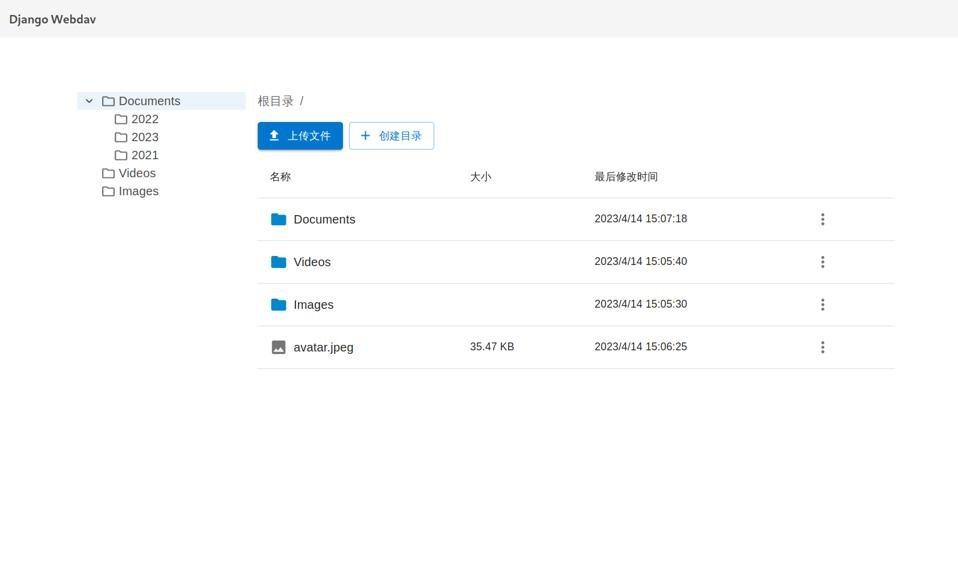

Django Webdav Client
====================

File Manager like dropbox

   Screenshot

Features
--------

-  文件管理
-  多级目录
-  分片上传
-  文件预览
-  评论
-  分享
-  操作历史

Depends on
----------

-  Django
-  djangorestframework
-  requests
-  Webdav
-  React + Vite
-  @mui/material

Quick Start
-----------

Install
~~~~~~~

.. code:: bash

   pip install django-webdav-ui

Update Settings.py
~~~~~~~~~~~~~~~~~~

.. code:: python

   INSTALLED_APPS = [
       ...
       'webdav',
       ...
   ]

   WEBDAV_HOST = 'localhost'
   WEBDAV_USER = 'demo'
   WEBDAV_PASSWORD = 'demopassword'

Update Urls.py
~~~~~~~~~~~~~~

.. code:: python

   urlpatterns = [
       ...
       path('webdav/', include('webdav.urls')),
       ...
   ]

Sync database
~~~~~~~~~~~~~

.. code:: bash

   python manage.py migrate

Reference
---------

-  Dropbox
-  Nextcloud

Todo
----

-  [ ] 优化安全
-  [ ] 排序
-  [ ] 搜索
-  [ ] Permission Controls
-  [ ] 收藏
-  [ ] 最近
-  [ ] 共享
-  [ ] 标签
-  [ ] Grid Display
-  [ ] 批量操作
-  [ ] 移动文件
